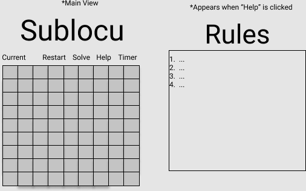

# Introduction

For project 3 of the SEI experience provided by General Assembly, the goal is to build a fully functioning web application using ReactJS and an API of our choosing. The app must contain the following components:

1. A front-end React application that updates the UI and makes requests to the API.
2. Includes data from a third-party API.

# Contributors

As this is a team project, the members consist of:
* [John Mieszkowski](https://github.com/jmieszko/)
* [Md Obaidulla](https://github.com/Mdobaidulla/project-3)
* [Jay Villari](https://github.com/jayvillari)

# Application Location
The web application is located <a href="https://soduko-app-mdobaidulla.herokuapp.com/#/">here</a>

# API Usage
To implement a working game of sudoku. The API is used to support the following:
* Generate a starting board, based on difficulty chosen from a GET request
* Use the response from the GET request to send as payload for another POST request. This POST request return our expected solution
* Then validate if a board is either solved or not solve
* If the board is solved correctly, then user will see an pop up message and the Next level will be unlocked.
* GitHub link for the 3rd party [API](https://sugoku.herokuapp.com/board)

# User Stories

- [x] As a user, I want to click on a box and enter a number so that I can input my response.

- [x] As a user, I want to only be able to enter a number, i.e. no letter or symbol, so that I can input a valid repsonse.

- [x] As a user, I want to know if the number I input into the box is correct or incorrect so that I can adjust my gameplay strategy as needed.

- [x] As a user, I do not want to change the value of a pre-populated box as that will alter the game itself.

- [x] As a user, I want to be notified when I have solved the puzzle, so that I can know that the game has ended.

- [x] As a user, I want the ability to click a button to end the current game so that I can start a new one.

- [x] As a user, I want to be able to view the rules, so that I understand how to solve the puzzle.

- [x] As a user, I want to be able to get the value from API for game board to have the game setup and be ready to play.

- [x] As a user, I want the board to keep a running timer on the game so that I know how much time I have remaining for that game.

## Future Enhancements

- [ ] As a user, I want to be able to click on a button to start a new game, only if no game is currently being played, so that I can play it.

- [ ] As a user, when I start a new game, I want to be notified if I am already in the middle of an existing game so that I don't end the existing game prematurely.

- [ ] As a user, I want to be able to select puzzle difficulty (easy/medium/hard), so that I can play a puzzle based on my skill level.

- [ ] As a user, which will show the solution to the puzzle even if I didn't solve it in order to better understand where each number should have been placed as well as end the current game.

- [ ] As a user, I want the game to keep track of the number of incorrect attempts during a game so that I can better track my abilities.

- [ ] As a user, I want the ability to restart a game so that I can try again if I make too many mistakes.

- [ ] As a user, I want the game to keep stats of the number of times I played in total and the number of times I won in each difficulty in order to better challenge myself.

- [ ] As a user, I want the ability to reset those stats in order to keep track of a new streak.

# Wireframes

Wireframe 

# Acknowledgements
The following resources were used in the implementation of this site:
 [Drop Down Menu in React](https://stackoverflow.com/questions/29108779/how-to-get-selected-value-of-a-dropdown-menu-in-reactjs)
